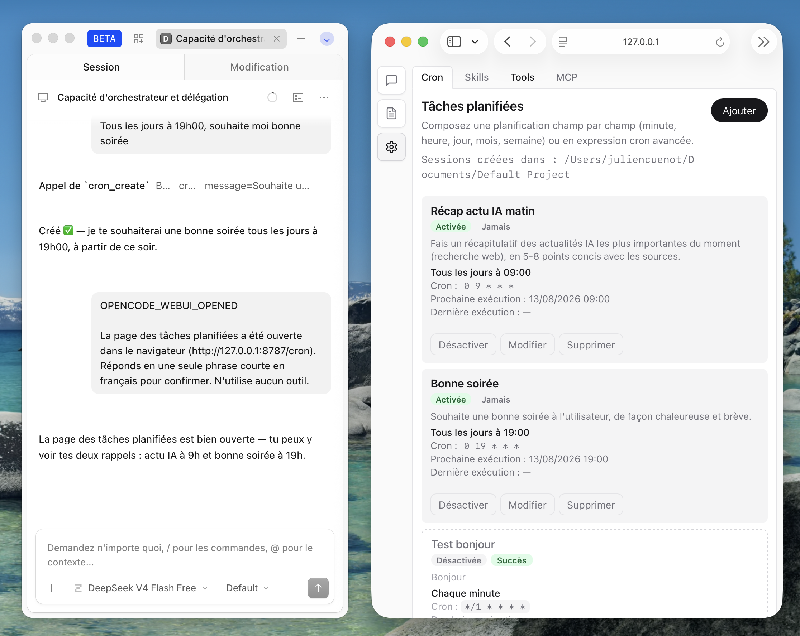

# opencode-dynatech



Monorepo des plugins OpenCode Dynatech.

## Packages

| Package | Rôle |
|---|---|
| [`opencode-dynatech-cron`](./opencode-dynatech-cron) | Scheduler cron + API JSON + outils chat |
| [`opencode-dynatech-webui`](./opencode-dynatech-webui) | Coquille UI locale (page cron, proxy API) |

## Installation runtime

Chaque package a son `scripts/install.sh` vers `~/.config/opencode/plugins/<nom>/`.

```bash
./opencode-dynatech-cron/scripts/install.sh
./opencode-dynatech-webui/scripts/install.sh
```

Puis redémarrer le service OpenCode.
